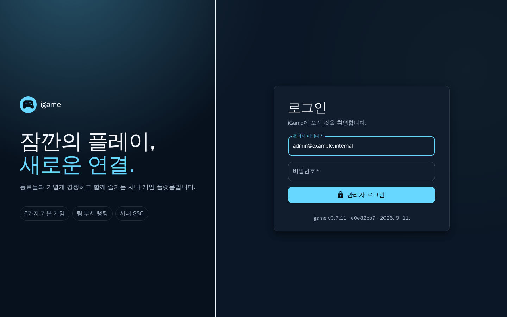
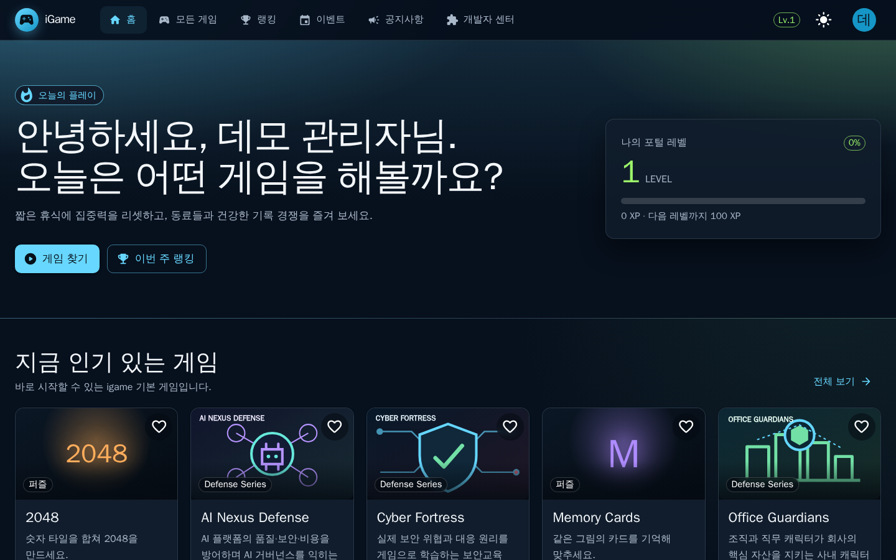
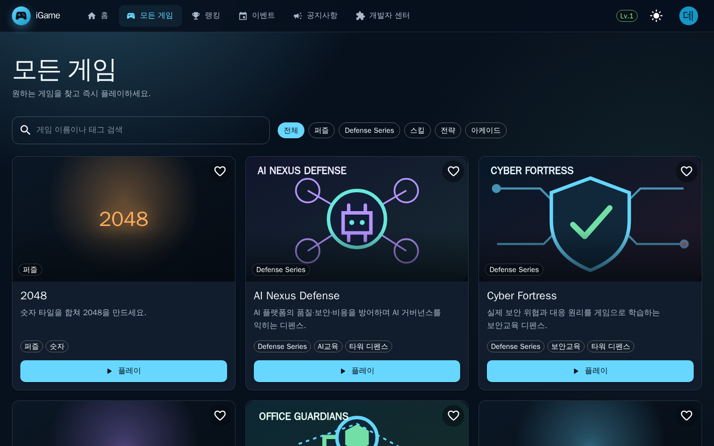
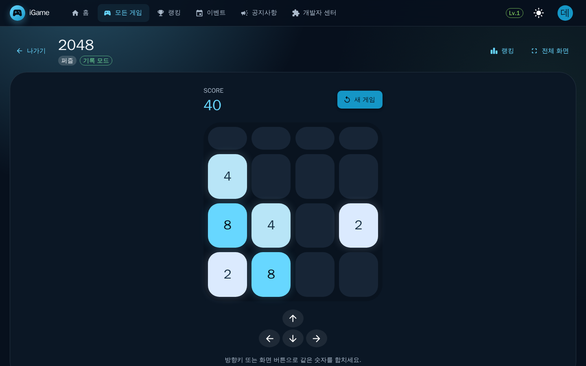
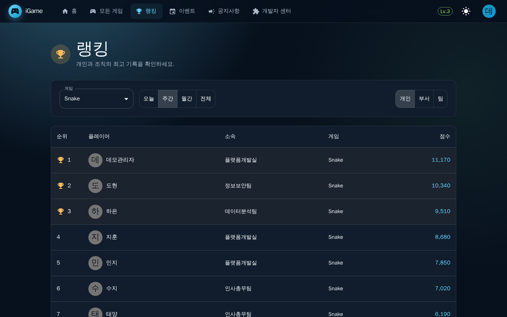
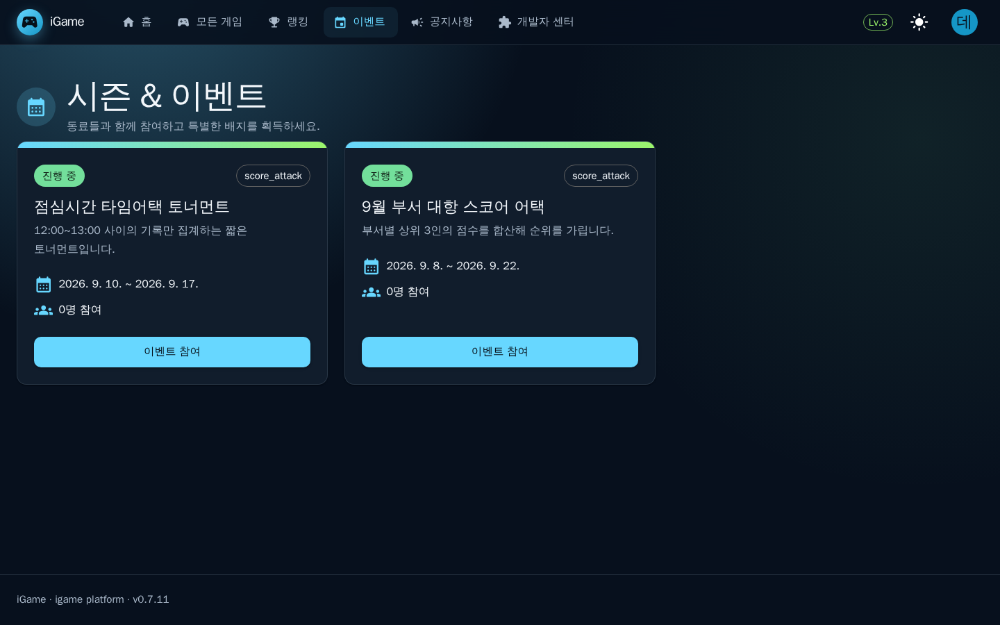
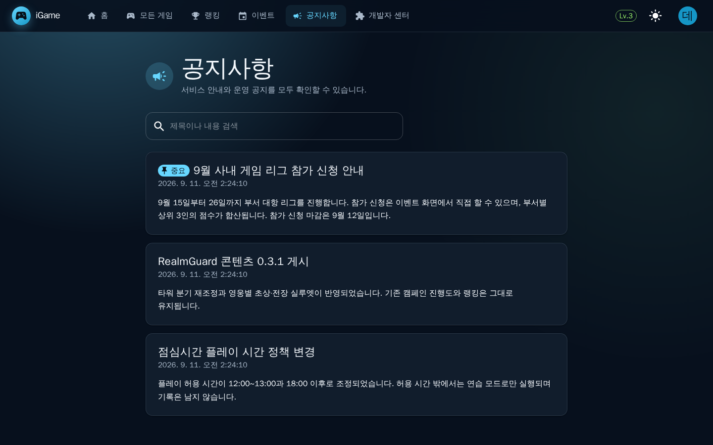
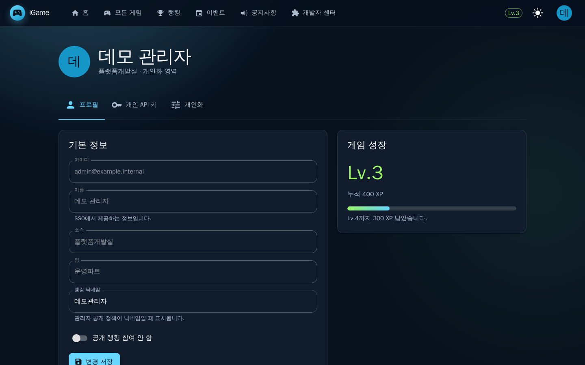
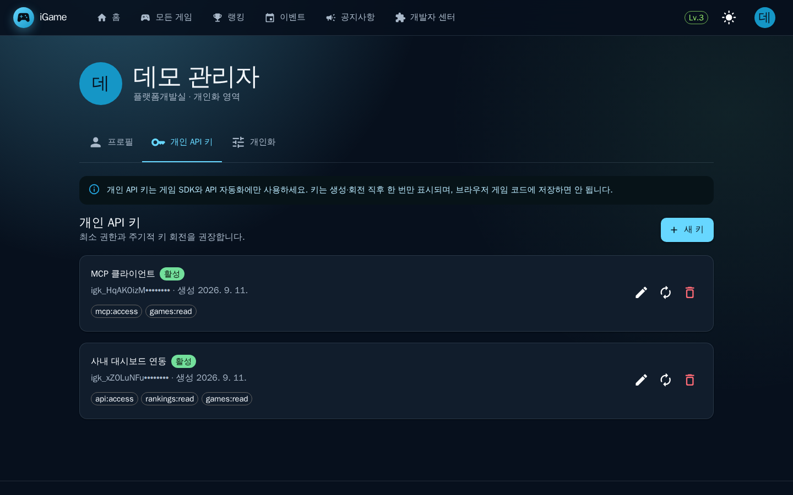
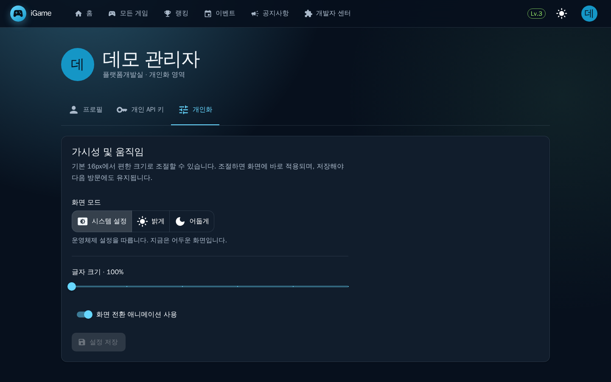

# igame 사용자 가이드

이 문서는 igame 포털을 **쓰는 사람**을 위한 것입니다. 서비스를 설치하고 운영하는 방법은
[관리자 가이드](ADMIN_GUIDE.md)에 있습니다.

이 가이드의 화면은 모두 `v0.7.11` 서비스를 실제로 띄워 1440×900 데스크톱 창에서 찍은 것이며,
등장하는 이름·아이디·소속은 전부 지어낸 예시 값입니다.

---

## 1. igame이 하는 일

igame은 사내 폐쇄망에서 도는 게임 포털입니다. 짧은 휴식에 바로 실행할 수 있는 게임을 모아
두고, 그 기록을 개인·부서·팀 단위 랭킹으로 정리합니다. 외부 인터넷으로 나가는 통신이 없으므로
게임 실행에 필요한 것은 전부 사내 서버 안에 있습니다.

게임은 두 갈래입니다. **2048, Memory Cards, Reaction Test, Snake, Typing Game**은 바로 켜서
몇 분 만에 끝낼 수 있는 캐주얼 게임이고, **RealmGuard**와 Defense Series 세 게임(**Office
Guardians**, **Cyber Fortress**, **AI Nexus Defense**)은 스테이지를 따라 진행하는 타워 디펜스
입니다. Cyber Fortress와 AI Nexus Defense는 보안·AI 거버넌스를 소재로 한 학습형이어서, 게임
점수와 별개로 학습 결과가 따로 기록됩니다.

쓰는 사람은 사내 구성원 전부입니다. 로그인해서 게임을 하고 랭킹을 보는 것이 기본이고, 개인
API 키를 발급받아 자기 게임을 SDK로 붙이거나 MCP 클라이언트를 연결하는 것도 같은 화면에서
합니다. 팀장·운영자 역할을 받은 사람에게는 검토·승인 화면과 관리자 콘솔이 추가로 열립니다.

---

## 2. 처음 5분

### 2.1 로그인

브라우저에서 서비스 주소를 열면 로그인 화면이 나옵니다.

- 사내 SSO(Keycloak)가 연결된 배포에서는 **사내 SSO로 계속** 버튼이 함께 나타납니다.
  그 버튼이 보이면 그쪽을 쓰세요. 계정·비밀번호를 igame이 따로 갖지 않습니다.
- SSO가 연결되어 있지 않으면 관리자에게 받은 아이디와 비밀번호로 **관리자 로그인**을 누릅니다.
- 카드 아래에 지금 접속한 서비스의 버전이 적혀 있습니다. 문제가 생겨 문의할 때 이 값을 함께
  알려 주면 좋습니다.

### 2.2 첫 게임 실행

로그인하면 홈이 열립니다.

오른쪽 위의 **나의 포털 레벨**은 플레이로 쌓인 XP를 보여 줍니다. 아래 **지금 인기 있는 게임**
에서 카드를 하나 고르거나 **게임 찾기**를 눌러 전체 목록으로 갑니다.

카드를 누르면 게임 화면이 열리고, 그 순간 플레이 세션이 시작됩니다.

제목 옆의 **기록 모드** / **연습 모드** 표시를 확인하세요.

- **기록 모드**: 세션이 정상적으로 열렸고, 끝낸 결과가 랭킹에 올라갑니다.
- **연습 모드**: 세션을 열지 못한 상태입니다. 플레이는 되지만 점수가 저장되지 않습니다.

게임이 끝나면 점수가 저장되고, 오른쪽 위 **랭킹** 버튼으로 그 게임의 순위를 바로 볼 수
있습니다. 여기까지가 첫 성과입니다.

---

## 3. 화면별 사용법

### 3.1 홈 (`/`)

인사말과 포털 레벨, 인기 게임, 최근 공지가 한 화면에 모여 있습니다. **게임 찾기**는 전체
카탈로그로, **이번 주 랭킹**은 랭킹 화면으로 갑니다. 상단 메뉴는 어느 화면에서나 같습니다 —
홈 · 모든 게임 · 랭킹 · 이벤트 · 공지사항 · 개발자 센터. AI 기능이 켜진 배포에서는 **AI Game
Lab**이, 검토 권한이 있으면 **승인함**이 여기에 함께 나타납니다.

오른쪽 끝의 해·달 아이콘은 밝은 화면과 어두운 화면을 그 자리에서 바꿉니다. 그 옆 동그란
아이콘이 프로필 메뉴입니다.

### 3.2 모든 게임 (`/games`)

카테고리와 검색으로 게임을 좁혀 봅니다. 카드 오른쪽 위의 하트를 누르면 즐겨찾기에 담깁니다.
카드에는 카테고리와 한 줄 설명이 붙어 있어, 처음 보는 게임도 무엇인지 알고 고를 수 있습니다.

### 3.3 게임 화면 (`/games/<게임>`)

- **나가기**: 카탈로그로 돌아갑니다.
- **랭킹**: 지금 하는 게임의 순위로 바로 이동합니다.
- **전체 화면**: 브라우저를 전체 화면으로 전환합니다.
- 캐주얼 게임은 방향키 또는 화면의 버튼으로 조작합니다. 조작법은 게임판 아래에 적혀 있습니다.

RealmGuard와 Defense Series는 스테이지를 고르고 타워를 세우는 방식이며, 공식 기록은 서버가
같은 전투를 다시 계산해 확정합니다. 그래서 게임 화면을 거치지 않고 점수만 따로 올릴 수는
없습니다.

### 3.4 랭킹 (`/rankings`)

- 왼쪽 **게임** 선택으로 종목을 바꿉니다.
- **오늘 · 주간 · 월간 · 전체**로 기간을 바꿉니다.
- 오른쪽 **개인 · 부서 · 팀**으로 집계 단위를 바꿉니다.

부서·팀 랭킹은 관리자가 조직명 공개를 켜 둔 배포에서만 열립니다. 꺼져 있으면
`조직 단위 랭킹은 현재 공개되어 있지 않습니다.` 라고 나옵니다. 랭킹에 이름을 올리고 싶지
않으면 프로필에서 **공개 랭킹 참여 안 함**을 켜면 됩니다.

### 3.5 이벤트 (`/events`)

진행 중인 이벤트가 카드로 나옵니다. 기간, 경쟁 방식, 지금까지 참여한 인원이 카드에 적혀
있고 **이벤트 참여**를 누르면 바로 참가됩니다. 아직 시작하지 않은 이벤트는 관리자가 공개하기
전까지 여기에 나타나지 않습니다.

### 3.6 공지사항 (`/notices`)

게시된 공지 전체를 제목과 내용으로 검색할 수 있습니다. **중요** 표시가 붙은 공지는 항상
목록 맨 위에 고정됩니다. 홈에도 최신 공지가 나오지만, 자리를 비운 사이 지나간 공지를 찾을
때는 이 화면을 씁니다.

### 3.7 프로필 (`/profile`)

- **아이디 · 이름 · 소속 · 팀**은 SSO에서 받아 오는 값이라 이 화면에서 고칠 수 없습니다.
  잘못된 값은 관리자에게 알려 주세요.
- **랭킹 닉네임**은 직접 정합니다. 관리자가 랭킹 표시 이름을 "닉네임"으로 설정해 둔 배포에서
  이 값이 순위표에 나옵니다.
- **공개 랭킹 참여 안 함**을 켜면 순위표에서 빠집니다. 기록 자체는 그대로 남습니다.
  관리자가 opt-out을 허용하지 않은 배포에서는 켜도 순위표에 계속 표시됩니다.
- 오른쪽 **게임 성장** 카드는 누적 XP와 다음 레벨까지 남은 XP를 보여 줍니다.

### 3.8 개인 API 키 (`/profile/keys`)

게임 SDK나 MCP 클라이언트에서 igame API를 부를 때 쓰는 키입니다.

- **새 키**를 누르고 이름과 권한을 고르면 발급됩니다. **키 값은 발급 직후 한 번만 보입니다.**
  그 자리에서 복사해 안전한 곳에 두세요. 목록에는 앞자리만 남습니다.
- 가운데 회전 아이콘은 **무중단 키 회전**입니다. 새 키를 발급하면서 이전 키에 유예 기간을
  두므로, 연동을 멈추지 않고 값을 바꿀 수 있습니다.
- 휴지통 아이콘은 즉시 폐기입니다.
- 권한은 필요한 것만 고르세요. 활성 키 개수와 최대 사용 기간은 관리자가 정한 한도를 따릅니다.

키는 브라우저에서 도는 게임 코드에 넣지 마세요. 화면에도 그렇게 안내되어 있습니다.

### 3.9 개인화 (`/profile/preferences`)

- **화면 모드**: 시스템 설정 / 밝게 / 어둡게. 기본값은 운영체제 설정을 따릅니다.
- **글자 크기**: 본문 16px 기준 100~125%. 움직이면 화면에 바로 반영되지만, **설정 저장**을
  눌러야 다음 방문에도 유지됩니다.
- **화면 전환 애니메이션 사용**: 움직임에 민감하면 끄세요.

이 설정은 쓰고 있는 브라우저에 저장됩니다. 사이트 데이터가 차단된 환경에서는 그 세션에만
적용됩니다.

### 3.10 개발자 센터 (`/developer`)

자기 게임을 igame에 붙일 때 쓰는 화면입니다. 인증·세션·점수·랭킹을 대신 처리하는 Game
SDK(`gamehub-js`)의 빠른 시작 예제가 있고, **SDK ESM 다운로드**와 **TypeScript 타입** 버튼으로
연동에 필요한 파일을 그 자리에서 받을 수 있습니다. 신규 게임 공개는 승인 정책이 켜져 있는
배포에서는 검토를 거친 뒤 반영됩니다.

---

## 4. 자주 하는 작업

### 4.1 점심시간에 한 판 하고 순위 확인하기

1. 홈에서 **게임 찾기** → 게임 카드를 누릅니다.
2. 제목 옆이 **기록 모드**인지 확인하고 플레이합니다.
3. 끝나면 오른쪽 위 **랭킹**을 눌러 그 게임의 순위를 봅니다.
4. 기간을 **오늘**로 바꾸면 오늘 기록만 모아 볼 수 있습니다.

### 4.2 부서 대항 이벤트에 참가하기

1. **이벤트** 메뉴를 엽니다.
2. **진행 중** 표시가 있는 카드에서 기간과 방식을 확인합니다.
3. **이벤트 참여**를 누릅니다.
4. 이벤트 대상 게임을 플레이하면 기록이 집계에 들어갑니다.

### 4.3 순위표에서 내 이름 대신 닉네임 쓰기

1. 프로필 메뉴 → **프로필**을 엽니다.
2. **랭킹 닉네임**에 원하는 값을 넣고 **변경 저장**을 누릅니다.
3. 관리자가 랭킹 표시 이름을 "닉네임"으로 설정해 둔 배포에서 순위표에 그 값이 나옵니다.
   실명 표시로 설정된 배포에서는 닉네임을 넣어도 화면에는 이름이 나옵니다.

### 4.4 순위표에서 빠지기

1. 프로필 메뉴 → **프로필**을 엽니다.
2. **공개 랭킹 참여 안 함**을 켜고 **변경 저장**을 누릅니다.
3. 관리자가 opt-out을 허용하지 않은 배포에서는 이 설정이 순위표에 반영되지 않습니다.
   그런 경우에는 관리자에게 문의하세요.

### 4.5 SDK 연동용 키 발급받고 나중에 바꾸기

1. 프로필 메뉴 → **개인 API 키**를 엽니다.
2. **새 키** → 이름과 권한 선택 → 발급.
3. 화면에 한 번 보이는 키 값을 복사해 둡니다.
4. 나중에 값을 바꿔야 하면 그 키의 **회전** 아이콘을 누릅니다. 유예 기간 동안 이전 키도
   같이 동작하므로 연동을 멈추지 않아도 됩니다.
5. 더 쓰지 않는 키는 휴지통 아이콘으로 폐기합니다.

---

## 5. 막혔을 때

화면에 그대로 뜨는 문구를 기준으로 정리했습니다.

| 화면에 나오는 문구 | 뜻과 할 일 |
| --- | --- |
| 아이디 또는 비밀번호가 올바르지 않습니다. | 오타를 확인하세요. SSO 계정은 이 입력란이 아니라 **사내 SSO로 로그인**으로 들어갑니다. |
| 로그인 시도가 너무 많습니다. 잠시 후 다시 시도해 주세요. | 짧은 시간에 실패가 반복되어 잠시 막힌 상태입니다. 문구에 적힌 시간만큼 기다리세요. |
| 관리자 로그인이 비활성화되어 있습니다. 사내 SSO로 로그인해 주세요. | 이 배포는 아이디·비밀번호 로그인을 쓰지 않습니다. SSO 버튼을 쓰세요. |
| 사내 SSO가 설정되어 있지 않습니다. 서비스 관리자에게 문의하세요. | SSO 연동이 아직 없습니다. **관리자에게 문의**하세요. |
| 사내 SSO 서버에 연결할 수 없습니다. | igame이 SSO 서버에 닿지 못한 상태입니다. 잠시 뒤 다시 시도하고, 계속되면 관리자에게 알리세요. |
| 로그인이 필요합니다. | 세션이 만료됐습니다. 다시 로그인하면 보던 화면으로 돌아옵니다. |
| 지금은 플레이할 수 있는 시간이 아니거나 오늘의 플레이 한도를 초과했습니다. | 관리자가 정한 허용 시간·일일 한도에 걸렸습니다. 허용 시간은 공지나 관리자에게 확인하세요. |
| 플레이 정책을 확인할 수 없어 게임을 시작하지 못했습니다. | 서버가 정책을 읽지 못한 일시적인 상태입니다. 잠시 뒤 다시 시도하고, 계속되면 관리자에게 알리세요. |
| 게임 세션이 만료되었거나 유효하지 않습니다. 게임을 다시 시작해 주세요. | 오래 열어 둔 화면입니다. 게임을 다시 시작하세요. |
| 세션을 너무 자주 시작했습니다. | 짧은 시간에 여러 번 시작했습니다. 잠시 기다렸다가 다시 시작하세요. |
| 이 세션의 점수는 이미 기록되었습니다. | 같은 판의 점수가 이미 올라갔습니다. 정상 동작입니다. |
| 게임 콘텐츠가 업데이트되었습니다. 페이지를 새로 고친 뒤 다시 시작해 주세요. | 플레이 중 관리자가 새 콘텐츠를 게시했습니다. 새로 고치면 최신 콘텐츠로 시작합니다. |
| 이 게임의 기록은 게임 화면을 통해서만 저장됩니다. | RealmGuard·Defense Series의 공식 기록은 게임 화면에서만 만들어집니다. |
| 조직 단위 랭킹은 현재 공개되어 있지 않습니다. | 관리자가 조직명 공개를 꺼 둔 배포입니다. 개인 랭킹은 그대로 볼 수 있습니다. |
| 활성 키 개수 한도에 도달했습니다. | 쓰지 않는 개인 API 키를 폐기한 뒤 다시 발급하세요. |
| 선택한 권한 중 이 역할에 허용되지 않은 항목이 있습니다. | 역할에 없는 권한입니다. 필요하면 **관리자에게 문의**하세요. |
| 사용 중인 키에 이 작업에 필요한 권한이 없습니다. | 키를 만들 때 고른 권한이 부족합니다. 권한을 다시 지정해 새 키를 발급하세요. |
| 접속한 주소가 서비스에 설정된 공개 URL과 달라 요청이 차단되었습니다. | 안내받은 주소로 접속했는지 확인하고, 맞다면 **관리자에게 문의**하세요. |
| AI 기능이 설정되어 있지 않습니다. | 이 배포는 AI 연동을 쓰지 않습니다. AI 메뉴 자체가 보이지 않을 수도 있습니다. |
| 서비스가 아직 준비되지 않았습니다. 잠시 후 다시 시도해 주세요. | 서비스가 데이터베이스에 닿지 못하는 상태입니다. 계속되면 **관리자에게 문의**하세요. |
| 본인이 올린 요청은 본인이 승인할 수 없습니다. / 같은 팀에서 작성한 요청만 검토할 수 있습니다. | 검토 권한이 있는 사람에게만 나오는 문구입니다. 다른 검토자에게 넘기세요. |

관리자에게 문의할 때는 **화면 주소, 문구 전체, 대략적인 시각, 로그인 화면 아래의 버전**을
함께 알려 주면 확인이 빨라집니다.

---

## 6. 용어

| 화면에 나오는 말 | 뜻 |
| --- | --- |
| 기록 모드 / 연습 모드 | 지금 플레이가 랭킹에 반영되는지 여부. 연습 모드에서는 점수가 저장되지 않습니다. |
| 포털 레벨 · XP | 플레이로 쌓이는 성장 지표. 게임 점수와는 별개입니다. |
| 시즌 | 랭킹을 끊어 집계하는 기간. 시즌이 바뀌면 새 기간의 순위가 다시 시작됩니다. |
| 이벤트 | 정해진 기간 동안 별도 규칙으로 겨루는 행사. 참여를 눌러야 집계됩니다. |
| 부서 · 팀 | 조직 정보. SSO에서 받아 오며 부서·팀 단위 랭킹의 기준이 됩니다. |
| 랭킹 닉네임 | 순위표에 실명 대신 표시할 이름. 관리자가 닉네임 표시를 켠 배포에서만 쓰입니다. |
| 개인 API 키 | SDK·MCP 연동용 개인 토큰. `igk_`로 시작하며 발급 직후 한 번만 전체 값이 보입니다. |
| 키 회전 | 이전 키의 유예 기간을 두고 새 키로 바꾸는 것. 연동을 멈추지 않고 값을 교체합니다. |
| 승인함 | 검토 권한이 있는 사람에게만 보이는 화면. 다른 사람이 올린 콘텐츠 변경을 승인·반려합니다. |
| Defense Series | 같은 엔진을 쓰는 세 학습형 디펜스 게임(Office Guardians, Cyber Fortress, AI Nexus Defense). |
| RealmGuard | igame의 독자 타워 디펜스. 공식 결과를 서버가 다시 계산해 확정합니다. |

---

## 더 읽을 것

- [관리자 가이드](ADMIN_GUIDE.md) — 설치·설정·운영·장애 대응
- [RealmGuard 운영 가이드](realmguard.md) · [Defense Series 운영 가이드](defense-series.md) — 콘텐츠 편집과 게시
- [API 계약](api.md) — SDK·MCP 연동에 필요한 엔드포인트
